<p align="center">
  
</p>

<p align="center">
  
  
  
  
  
</p>

<p align="center">
  <strong>Beat roots. Beat them all. Be a BeatRooter.</strong>
</p>

---

# BeatRooter

> **BeatRooter** is a visual platform for mapping, running, documenting and understanding cybersecurity operations. It is built for Red Team, Blue Team, Purple Team, Wargaming classes, controlled labs and teams that need to turn technical chaos into a readable operational scenario.

## What It Is

BeatRooter brings together an **operational canvas**, specialized nodes, external tools, notes, evidence, reports, assistants and an experimental simulation line. Instead of scattering outputs across terminals, loose files and forgotten screenshots, the application organizes an engagement as a living map: targets, services, vulnerabilities, credentials, observations, decisions, evidence and attack paths.

The goal is simple: help a team see the system, reason about it and act with context.

<p align="center">
  
</p>

## Ecosystem Map

```mermaid
%%{init: {'theme':'base','themeVariables':{'background':'#0d1117','primaryColor':'#121820','primaryTextColor':'#f5f7fb','primaryBorderColor':'#923A5F','lineColor':'#923A5F','secondaryColor':'#171f2a','tertiaryColor':'#1f2937','fontFamily':'JetBrains Mono, monospace','fontSize':'13px'}}}%%
flowchart TB
  BR["BeatRooter<br/>Visual Cyber Operations"]:::core

  BR --> C["Canvas<br/>map the operation"]:::canvas
  BR --> T["Tool Nodes<br/>run with context"]:::tools
  BR --> K["Knowledge Layer<br/>notes, nodes, evidence"]:::knowledge
  BR --> A["Gnarl<br/>assist the workflow"]:::assistant
  BR --> R["Reports<br/>explain the path"]:::reports
  BR --> B["BeatBox<br/>sandbox in progress"]:::sandbox

  C --> C1["Stackers"]
  C --> C2["Dynamic Edges"]
  C --> C3["Detail Panel"]

  T --> T1["Network / Infra"]
  T --> T2["Web / DNS"]
  T --> T3["Reverse / Forensics"]
  T --> T4["Wordlists"]

  K --> K1["Assets"]
  K --> K2["Findings"]
  K --> K3["Evidence"]
  K --> K4["BeatNote"]

  R --> R1["Attack Paths"]
  R --> R2["Exports"]

  B --> B1["NETWORK-BB"]
  B --> B2["OS-BB"]
  B --> B3["WEB-BB"]

  classDef core fill:#923A5F,stroke:#f4d35e,color:#ffffff,stroke-width:2px;
  classDef canvas fill:#13251d,stroke:#22c55e,color:#ecfdf5,stroke-width:1.5px;
  classDef tools fill:#13253a,stroke:#60a5fa,color:#eff6ff,stroke-width:1.5px;
  classDef knowledge fill:#2a1f13,stroke:#f59e0b,color:#fff7ed,stroke-width:1.5px;
  classDef assistant fill:#2b1935,stroke:#c084fc,color:#faf5ff,stroke-width:1.5px;
  classDef reports fill:#281b1b,stroke:#fb7185,color:#fff1f2,stroke-width:1.5px;
  classDef sandbox fill:#172033,stroke:#38bdf8,color:#f0f9ff,stroke-width:1.5px;
  classDef default fill:#111827,stroke:#374151,color:#e5e7eb,stroke-width:1px;
```



## Highlights

- **Visual attack and defense canvas** with nodes, dynamic edges, stackers, detail panels and scenario organization.
- **Rich node library** for assets, hosts, IPs, domains, web apps, ports, services, vulnerabilities, credentials, evidence, notes, timelines, incidents, TTPs, findings and remediation plans.
- **Attack Path Builder** for structuring attack chains, payloads, pivots, results and reports.
- **Tool Nodes** that run external tools from the graph and return results back into the canvas.
- **BeatNote** for technical notes, categories, work context and documentation inside the application.
- **Gnarl** as the BeatRooter assistant and visual character, with panel, sprites and contextual behavior.
- **CVSS v4 Calculator** for quick severity scoring.
- **Wordlists** with presets, imports and integration with tools that need lists.
- **Custom Nodes** for adapting the graph to a specific operation, lab or methodology.
- **Onboarding and preferences** for first setup, language, appearance, shortcuts and workflow.
- **Bilingual UI** in English and Portuguese, with structured catalogs and a compatibility layer for legacy Qt text.

## Features

### BeatRooter Canvas

The canvas is the center of the application. It lets you build the full map of an operation:

- add, edit, connect, duplicate and organize nodes;
- represent infrastructure, applications, endpoints, users, artifacts and findings;
- create semantic relationships between assets, observations, evidence and actions;
- use stackers to group machines, environments or investigation areas;
- save and restore `.brt` projects;
- generate snapshots and reports from the graph.

### Nodes And Relationships

BeatRooter does not treat everything as a generic note. It has node types for different security domains:

| Family | Examples |
|---|---|
| Assets | IP, Host, Domain, Web Application, User, Credential, Infra Asset |
| Observations | Port/Service, Endpoint, DNS, Dynamic Trace, Behavior Analysis |
| Attack | Attack, Attack Chain, Exploit, Payload, Lateral Movement, Privilege Escalation |
| Defense | Control Gap, Containment Action, Hardening Task, Remediation Plan |
| Evidence | Screenshot, Forensic Artifact, Script, Binary Sample, Configuration File |
| Investigation | Investigation Note, Hypothesis, Incident Timeline, Triage Decision, Ticket |
| Specialized | Mobile Finding, Crypto Finding, Malware Sample, YARA Rules, Compliance Requirement |

### Attack Paths And Reports

Attack paths help transform loose findings into an operational story:

- link attack stages with context;
- track evidence and results;
- structure payloads and transitions;
- support attack path reports;
- make progression easier to explain to a technical team or a defensive audience.

### Integrated Tools

BeatRooter includes an execution and management layer for external tools. Tool nodes can receive context from the canvas, run commands and attach results.

| Area | Tools |
|---|---|
| Network / Infra | Nmap, Masscan, Enum4linux, RPCClient, Netcat, Hydra |
| Web / DNS | Gobuster, WhatWeb, SQLMap, DNS Utils, Subfinder, Amass, Whois |
| File / Reverse / Forensics | ExifTool, Binwalk, Strings, Steghide, John the Ripper, Hashcat, Ghidra |
| Capture / Traffic | TShark |
| Research / Search | Searchsploit |
| Generation / Wordlists | CUPP |

Use these tools only in systems you own, labs, CTFs or environments where you have explicit authorization.

### BeatNote

BeatNote is BeatRooter's operational notebook:

- notes by category;
- integrated workspace panel;
- dedicated writing and review dialog;
- service layer for note management;
- natural connection to nodes, findings and engagement documentation.

### Gnarl

Gnarl is BeatRooter's assistive and visual presence. The module includes:

- floating panel;
- sprite and display states;
- contextual interaction;
- scenario integration;
- foundation for smarter workspace assistance.

### CVSS v4

The CVSS v4 calculator lets you score severity without leaving the workflow. It is useful for triage, prioritization and technical finding documentation.

### Languages

BeatRooter keeps English and Portuguese in sync through:

- structured JSON catalogs;
- a language manager;
- compatibility for legacy Qt text;
- language selection in preferences.

## In Development

### BeatBox / Sandbox

**BeatBox** is BeatRooter's experimental simulation and training line. The idea is to create controlled environments where users can assemble, observe and test scenarios without touching production.

Current work is split into three boxes:

| BeatBox | Goal |
|---|---|
| `NETWORK-BB` | network simulation, composition, links and traffic |
| `OS-BB` | systems, states, processes and local attack surfaces |
| `WEB-BB` | web applications, endpoints and exploitation paths |

Inside the application, `features/sandbox` already provides the base for:

- network, operating system and web workspaces;
- sandbox objects;
- object connections;
- dedicated toolbox;
- detail panel;
- undo/redo actions;
- state and network tracing engines.

BeatBox is still evolving, but it points to a strong direction: learn, train, demonstrate and validate scenarios inside a visual lab.

### Technical Roadmap

- improve tool result integration with specialized nodes;
- consolidate scenario reports;
- expand custom nodes and templates;
- mature BeatBox/Sandbox;
- strengthen automated UI and core tests;
- improve tool installation and detection on Linux, Windows and WSL.

## Project Structure

```text
BeatRooter/
  main.py                         # PyQt6 entry point
  features/
    beatroot_canvas/              # main visual workspace
      core/                       # graph, storage, templates, attack paths, validation
      models/                     # graph/node/edge models
      ui/                         # window, canvas, toolbox, panels, dialogs, painting
    beatnote/                     # operational notes and documentation
      core/
      ui/
    tools/                        # external tool management, execution and parsing
      core/
      contexts/
      docker/
      integrations/
      parsers/
      agents/
    gnarl/                        # visual assistant and integrations
    cvss/                         # CVSS v4 calculator
    wordlists/                    # wordlist presets and import
    onboarding/                   # first-run wizard and preferences
    language/                     # EN/PT catalogs and legacy translation
    sandbox/                      # experimental BeatBox/Sandbox
assets/                           # logos, images and visual assets
docs/                             # technical documentation
tests/projects/                   # feature-level tests
BeatBox/                          # NETWORK-BB, OS-BB and WEB-BB prototypes
```

## Installation

### Requirements

- Python 3.8+
- PyQt6
- Linux, Windows or WSL
- Optional external security tools depending on the operation

### Local Environment

```bash
python -m venv .venv
source .venv/bin/activate
pip install -r requirements.txt
python BeatRooter/main.py
```

On Windows:

```powershell
.\.venv\Scripts\activate
python BeatRooter\main.py
```

### Tests

```bash
QT_QPA_PLATFORM=offscreen python -m unittest discover -s tests/projects -p "test_*.py"
QT_QPA_PLATFORM=offscreen python -m unittest tests.projects.beatnote.test_beatnote_service
QT_QPA_PLATFORM=offscreen python -m unittest tests.projects.language.test_language_manager
```

## Workflow

1. Create or open a `.brt` project.
2. Add assets, services, observations and evidence to the canvas.
3. Link nodes to represent real relationships: source, target, service, vulnerability, credential, exploitation and containment.
4. Run tools when you need new data.
5. Use BeatNote to record decisions, hypotheses and technical notes.
6. Build attack paths to explain progression, impact and recommendations.
7. Export or present the scenario as living documentation.

## Use Cases

### Red Team

- network and application reconnaissance;
- attack surface mapping;
- vulnerability and credential organization;
- exploitation and post-exploitation documentation;
- technical reporting narratives.

### Blue Team

- visual infrastructure inventory;
- exposure analysis;
- finding triage;
- hardening planning;
- incident response simulation.

### Purple Team

- align attack, detection and remediation in the same map;
- validate detection hypotheses;
- identify coverage gaps;
- repeat scenarios with comparable evidence.

### Education, CTF And Wargaming

- train adversarial thinking;
- create visual labs;
- explain technical chains to students;
- turn exercises into reusable maps.

## Small Manifesto

<table>
<tr>
<td valign="top" width="50%">

**`canvas/operation.brt`** &nbsp; <sub><i>map it</i></sub>

```text
Target
  -> Host
  -> Port / Service
  -> Finding
  -> Exploit
  -> Credential
  -> Lateral Movement
  -> Evidence
  -> Report
```

</td>
<td valign="top" width="50%">

**`beatrooter/method.md`** &nbsp; <sub><i>beat it</i></sub>

```markdown
1. See the system.
2. Connect the facts.
3. Test with permission.
4. Keep the evidence.
5. Explain the path.
6. Improve the defense.
```

</td>
</tr>
</table>

## Responsible Use

BeatRooter was created for learning, research, labs and authorized work. Many integrated tools can generate offensive traffic, perform aggressive enumeration or handle sensitive artifacts.

Use it only in:

- systems you own;
- lab environments;
- CTFs and wargames;
- audits with explicit authorization;
- defensive activities inside your scope.

Do not use BeatRooter to attack, test or enumerate third-party systems without permission.

## Contributing

Contributions are welcome, especially around:

- node templates;
- result parsers;
- tool integrations;
- UI/UX improvements;
- automated tests;
- documentation;
- BeatBox/Sandbox.

Quick guidelines:

- keep changes focused;
- avoid credentials, personal paths and accidental `.brt` files;
- add tests when changing shared behavior;
- when changing visible UI text, update English and Portuguese;
- use short imperative commit messages.

## Development Team

<div align="center">
  <a href="https://github.com/Samucahub/BeatRooter/graphs/contributors">
    
  </a>
</div>

## Acknowledgements

- **ISTEC** and the Wargaming context that gave origin to the project.
- **Open Source Community**, for the shared tools, projects and knowledge.
- **MITRE ATT&CK**, for the shared language around tactics, techniques and procedures.
- **OWASP**, for application security methodologies and references.
- Everyone who tests, breaks, fixes and improves BeatRooter.

## License

This project is provided for educational use. Redistribution, commercial use or use outside that context must respect author authorization and applicable law.

---

<div align="center">

**Visualize. Map. Attack. Defend.**

Made with coffee by the BeatRooter team.

</div>
